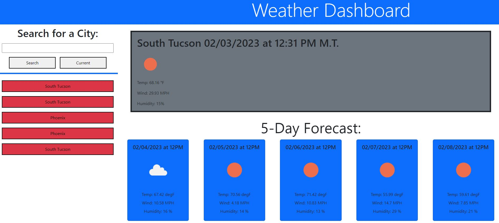

# myWeatherService

## Description

This weather dashboard is an application that allows the user to search and display current and 5-day weather forecast data hosted on OpenWeather's API. Upon loading, any previous search history will appear on the dashboard up to 10 queries. When the user searches for a new location it is added to search history. The layout displays the city name, the date, an icon representation of weather conditions, the temperature, the humidity, and the the wind speed.

### User Story:

AS A traveler
I WANT to see the weather outlook for multiple cities
SO THAT I can plan a trip accordingly

### New Skills:

- Knowing differences between a client-side and server-side API
- Utilizing a client-server model and request-response pattern
- Implementing HTTP GET requests using XMLHTTPRequest, jQuery AJAX and fetch API
- Handling HTTP response codes and handle response metadata with fetch API (headers, status, statusText, url)
- Parsing JSON to dynamically generate HTML
- Navigating the benefits and challenges of working with asynchronous JavaScript
- Implementing query string parameters

## Table of Contents (Optional)

- [Installation](#installation)
- [Usage](#usage)
- [Badges](#badges)
- [How_to_Contribute](#how_to_contribute)
- [Credits](#credits)
- [License](#license)

## Installation

No installation needed.

## Usage

The website can be found at: https://arishorts.github.io/myWeatherService/

The user is presented a weather dashboard with options for input. They may search for location, use current location, or select within their search history. The search history is persistent and will reload on the page upon user browser reload.  

## Badges

 
 

## How_to_Contribute

If you would like to contribute, refer to the [Contributor Covenant](https://www.contributor-covenant.org/)

## Credits

- Mosh Hamedani: https://codewithmosh.com/
- Jquery Tutorial (Udemy): https://www.udemy.com/course/jquery-tutorial/learn/lecture/4968932#notes
- OpenWeather API : https://openweathermap.org/api

## License

MIT License https://choosealicense.com/licenses/mit/

---

© 2022 Ariel Schwartz LLC. Confidential and Proprietary. All Rights Reserved.
